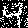

# gopfield

[](https://godoc.org/github.com/milosgajdos83/gopfield)
[](https://opensource.org/licenses/Apache-2.0)
[](https://travis-ci.org/milosgajdos83/gopfield)
[](https://goreportcard.com/report/github.com/milosgajdos83/gopfield)
[](https://codecov.io/gh/milosgajdos83/gopfield)

This project provides an implementation of [Hopfield network](https://en.wikipedia.org/wiki/Hopfield_network) in Go. It implements both [Hebbian](https://en.wikipedia.org/wiki/Hopfield_network#Hebbian_learning_rule_for_Hopfield_networks) and [Storkey](https://en.wikipedia.org/wiki/Hopfield_network#The_Storkey_learning_rule) training algorithms. The goal is to provide a simple API to build Hopfield networks in `Go`.

# Get started

Get the source code:

```
$ go get -u github.com/milosgajdos83/gopfield
```

**Make sure you've got all the dependencies** (`go get -u` should retrieve them, but this project might use a specific version of `gonum` so make sure you run the following command):

```
$ make dep
```

Run the tests:

```
$ make test
```

# Example

You can see an example program below. It first creates a Hopfield network pattern based on arbitrary data. The data is encoded into binary values of +1/-1 (see the documentation) using `Encode` function. It is then stored in the network and then restored.

```go
package main

import (
	"fmt"
	"os"

	"github.com/milosgajdos83/gopfield/hopfield"
)

func main() {
	pattern := hopfield.Encode([]float64{0.2, -12.4, 0.0, 3.4})
	// Create new Hopfield Network and set its size to the length of pattern
	n, err := hopfield.NewNetwork(pattern.Len(), "hebbian")
	if err != nil {
		fmt.Fprintf(os.Stderr, "\nERROR: %s\n", err)
		os.Exit(1)
	}
	fmt.Printf("Storing: \n%v\n\n", pattern)
	// store patterns in Hopfield network
	if err := n.Store([]*hopfield.Pattern{pattern}); err != nil {
		fmt.Fprintf(os.Stderr, "\nERROR: %s\n", err)
		os.Exit(1)
	}

	// restore image from Hopfield network
	res, err := n.Restore(pattern, "async", 10)
	if err != nil {
		fmt.Fprintf(os.Stderr, "\nERROR: %s\n", err)
		os.Exit(1)
	}
	fmt.Printf("Restored: \n%v\n", res)
}
```

If you run this program, you will see the pattern being reconstructed correctly:

```
$ go run main.go
Storing:
⎡ 1⎤
⎢-1⎥
⎢-1⎥
⎣ 1⎦

Restored:
⎡ 1⎤
⎢-1⎥
⎢-1⎥
⎣ 1⎦
```

You can find a more elaborate example in the `examples` directory of the project. There is a mnist example which tries to reconstruct a corrupted image loaded from the `patterns` subdirectory which contains two [MNIST](http://yann.lecun.com/exdb/mnist/) images: 0 and 4. These are stored in the Hopfield neural network. The mnist program then picks image `4` and adds some random noise to it. Finallys, it tries to reconstruct the original image from the network. See below how to use the example program:

First you need to build it:

```
$ make examples
```

If the build succeeds, you will find the built binary in `_build` directory of the project root. You can find out the cli options it provides:

```
$  _build/mnist -h
```

Example run:

```
$ _build/mnist -mode "async" -iters 1 -datadir ./examples/mnist/patterns/ -output out.png -training "storkey"
```

This will generate two files in directory: `noisy.png` and `out.png`.

`noisy.png` image displays the file that was attempted to be reconstructed from the network:




`out.png` image shows the reconstucted image:


